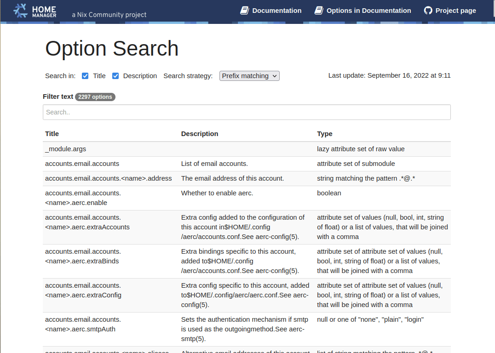

# Nix Darwin Options Search

## Home Manager Options Search has moved

The new location is <a href="https://home-manager-options.extranix.com/">HOME-MANAGER-OPTIONS.EXTRANIX.COM</a>

## Please update your bookmarks

Find [nix darwin](https://github.com/nix-darwin/darwinpkgs) options quickly.



## Maintainers Notes

After a new NixOS and Nix Darwin release, update the release info in the Hugo
config:

Edit `config.yaml`, and update the following...

```yaml
params:
  release_current_stable: nix-darwin-24.11
  releases:
    - name: unstable
      value: master
    - name: 24.11 (stable)
      value: nix-darwin-24.11
```

This file is used by ./scripts/build_and_parse_hm_options.rb and by Hugo when
generating a new website version.

## Contribute

- Please use the issue tracker or fork this site for PR's

## Credits

- Powered by the [Nix Darwin](https://nix-darwin.org/)
- [JS Search](https://github.com/bvaughn/js-search), efficient, client-side search library for JavaScript and JSON objects
- Header inspired by the [DocDock](https://docdock.vjeantet.fr/) Hugo Theme.
- The guy behind the original repo: [home-manager-options](https://github.com/mipmip)
